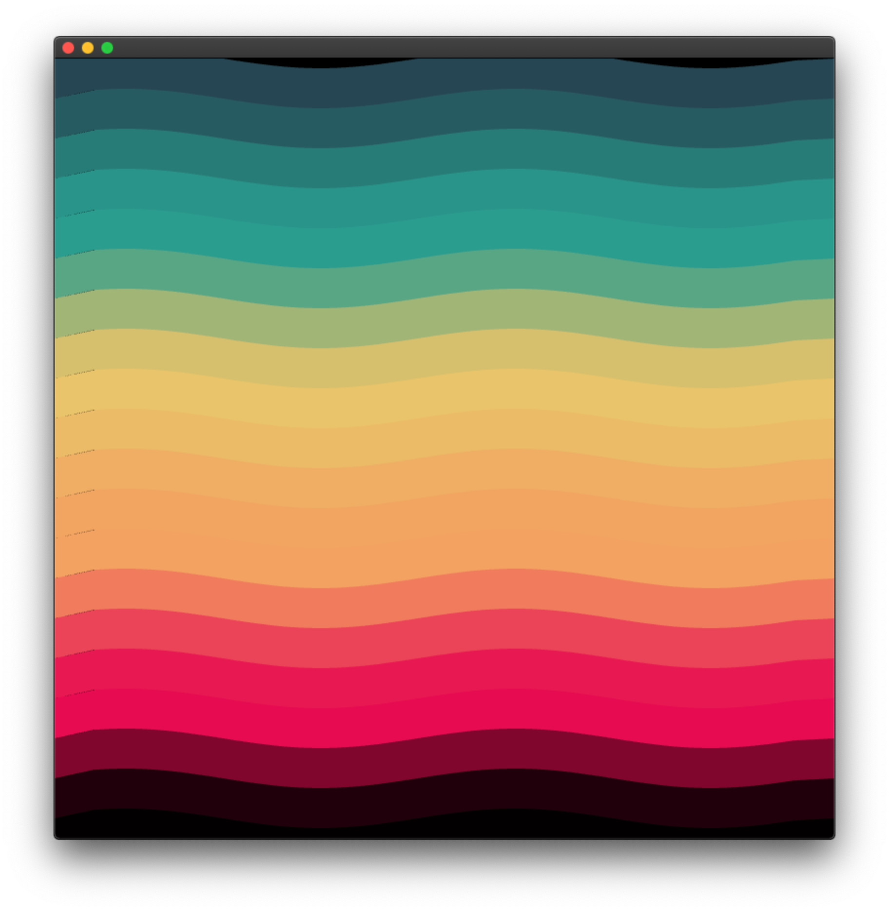
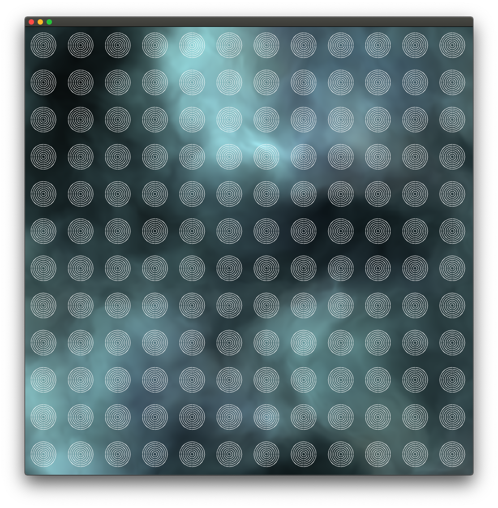

# Pancakes

🥞 – Pancakes is my list of everyday experiments with openframeworks

# Index

- **001** - test on classes
- **002** - including mouvement and arguments
- **003** - including grid generator
- **004** – including sound analyzer
- **005** –
- **006** –
- **007** – including custom shaders
- **008** – emproved grid class
- **009** – waver sine
- **010** – waver lerping colors
- **011** –
- **012** – added noise shader

# 📺 008

# 📺 009

# 📺 010

# 📺 012

